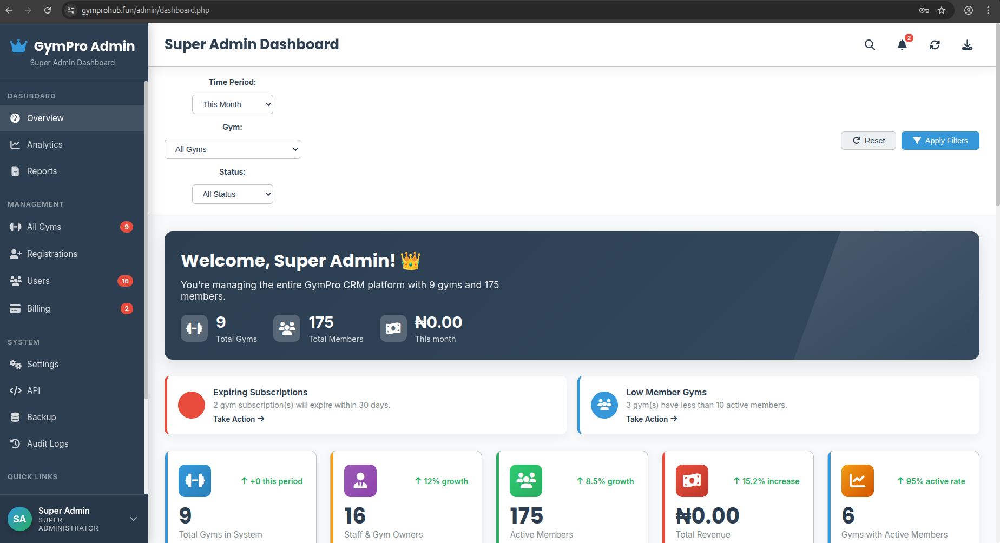
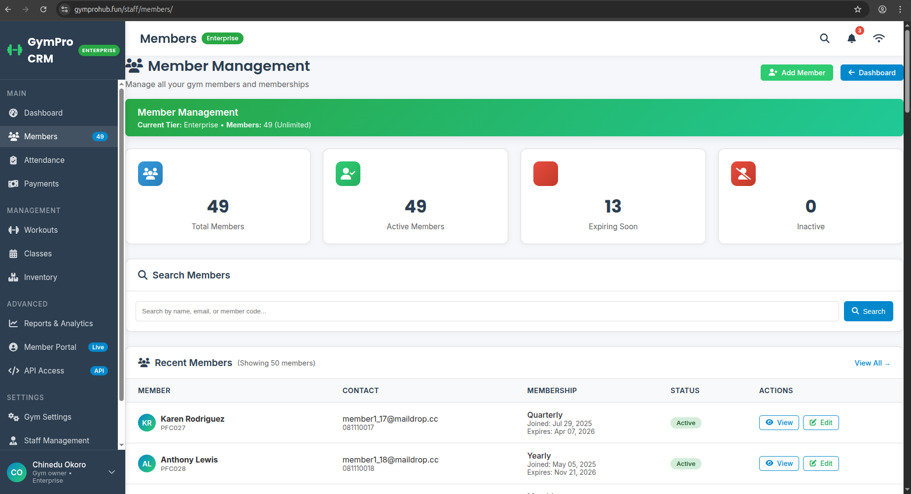
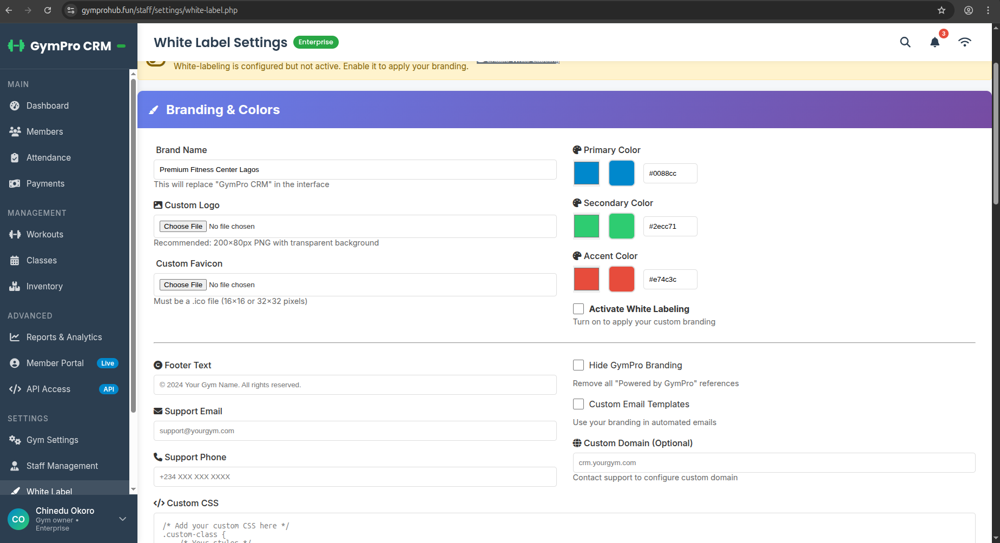
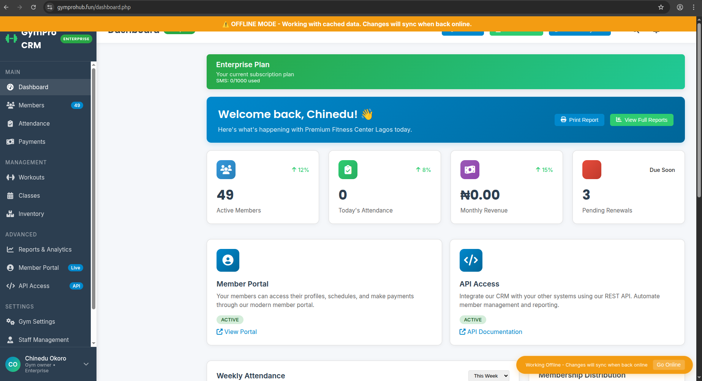
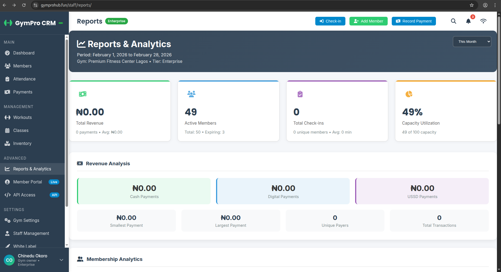

markdown
# GymCRM - Gym Management SaaS Platform

**This repository contains the file structure and database schema of a production gym management system. Source code has been replaced with placeholders for confidentiality.**

---

## Project Overview

GymCRM is a multi-tenant SaaS platform serving 50+ gyms across Nigeria. It provides gym owners with member management, payment processing, attendance tracking, and a white-labeled member portal.

**Role:** Lead Developer & System Architect  
**Timeline:** 8 months development  
**Status:** Production (50+ active gyms, 15,000+ members)

---

## Why This Project Matters

Most gym software is built for Western markets:
- Requires constant internet
- Only supports credit cards
- Costs $100+ per month
- No branding options

Nigerian gyms needed something different:
- Works during internet outages
- Accepts bank transfers and USSD
- Affordable pricing
- Custom branding for each gym

This system was built specifically for these requirements.

---

## Technical Stack

**Backend**
- PHP 8.3
- MySQL 8.0
- Apache/Nginx

**Frontend**
- JavaScript (vanilla)
- Bootstrap 5
- PWA (Service Workers)

**Integrations**
- Paystack API
- NaijaBased Directory
- PHPMailer
- SMS Gateway

---
## Documentation

- [Project Overview](_docs/01-overview.md) - Scope, goals, and current status
- [Database Overview](_docs/02-database-overview.md) - Table structure, relationships, views
- [Features Overview](_docs/03-features.md) - Detailed breakdown by user role and subscription tier
- [Technical Challenges](_docs/04-challenges.md) - Problems solved and implementation details

## Key Features

**Multi-Tenant Architecture**
- Single codebase serving 50+ gyms
- Complete data isolation between tenants
- Custom subdomains (gymname.gymcrm.com)
- Custom domain support

**White-Label Platform**
- Per-gym branding (colors, logos, favicons)
- Optional GymCRM branding removal
- Custom CSS injection
- Branded email templates

**Member Management**
- Member profiles with photos
- Membership plans (monthly, quarterly, yearly)
- Automated expiry notifications
- Digital ID card generation
- Attendance check-in/out

**Payment Processing**
- Paystack integration (cards, transfer, USSD)
- Manual payment recording
- Invoice generation
- Payment history and receipts
- Webhook verification

**Offline Capability**
- Service Worker caches static assets
- Offline data storage with background sync
- Visual offline indicator
- Works during internet outages

**Staff Management**
- Role-based access (admin, trainer, receptionist)
- Permission controls
- Staff attendance tracking

**Member Portal (PWA)**
- Self-service registration
- Online payments
- Membership status
- Attendance history
- Installable on mobile devices

**Reporting & Analytics**
- Revenue reports
- Member growth charts
- Attendance heatmaps
- Expiry alerts
- Export to PDF/Excel

---

## Project Structure
gym-crm/
├── admin/ - Gym owner administration panel
├── api/ - REST API endpoints
├── app/ - MVC controllers and models
├── assets/ - CSS, JavaScript, images
├── cache/ - Offline data storage
├── config/ - Database and service configuration
├── database/ - Migration files
├── includes/ - Core helpers and features
├── members/ - Member portal (PWA)
├── payments/ - Paystack integration
├── public/ - Service worker, manifest
├── staff/ - Trainer and receptionist panel
└── *.php - Entry points (logic removed)

text

---

## Database Design

The system uses a shared database with tenant isolation via `gym_id` on all tables.

**Core Tables**
- `gyms` - Tenant root
- `users` - System users (gym owners, staff)
- `members` - Member profiles and memberships
- `payments` - Transaction records
- `attendance` - Check-in/out logs
- `white_label_settings` - Per-gym branding

**Supporting Tables**
- `gym_classes` - Class schedules
- `equipment` - Inventory tracking
- `invoices` - Billing records
- `notifications` - In-app alerts
- `sms_logs` - Message history
- `api_keys` - Third-party access

**Views**
- `active_members_summary`
- `expiring_memberships`
- `monthly_revenue`
- `todays_attendance`
- `pending_gym_registrations`

Full schema available in the SQL dump included in this repository.

---

## Technical Challenges Solved

**1. Offline Operations**

Internet connectivity in Nigerian gyms is unreliable. Members need to check in and payments need to be recorded regardless of connection status.

The solution uses Service Workers to cache the application shell. Offline actions are stored as JSON files and processed in sequence when connection is restored. A visual indicator shows offline status. This handles hundreds of daily offline transactions.

**2. Multi-Tenant Branding**

Each gym needed their own look while sharing the same codebase. Storing CSS values per-gym in the database and injecting them at runtime solved this. No file system writes, instant activation, and easy backup. Custom domain support required additional DNS configuration guidance for gym owners.

**3. Payment Verification**

Paystack webhooks needed reliable processing. The system verifies webhook signatures, idempotency keys prevent duplicates, and failed webhooks are logged for manual reconciliation. Membership expiry dates update automatically upon successful payment.

**4. Member Self-Registration**

Gyms wanted members to register online without visiting the facility. The solution includes a multi-step registration form, email verification, and admin approval workflow. Optional auto-approval for trusted gyms.

**5. Performance at Scale**

Fifty gyms with 15,000 members required query optimization. Strategic indexes on foreign keys and frequently queried columns reduced query time. Database views simplified complex reporting queries. Caching of white-label CSS reduced database lookups.

---

## Production Metrics

- **50+** active gyms
- **15,000+** registered members
- **₦50M+** payment volume processed
- **2,000+** PWA installs
- **500+** daily offline check-ins
- **Zero** reported data loss incidents

---

## Screenshots

Screenshots are organized in the `_screenshots/` directory:

- **Dashboard** - Admin overview, gym owner dashboard, staff view
- **Member Management** - Member lists, profiles, ID cards
- **Payments** - Checkout, history, invoices
- **White Label** - Branding settings, branded portals
- **Offline Mode** - Offline indicator, sync queue
- **Reports** - Charts, exports
- **Mobile** - PWA on mobile devices

## Screenshots

| Dashboard | Member Management | Payments |
|-----------|-------------------|----------|
|  |  |  |

| White Label | Offline Mode | Reports |
|-------------|--------------|---------|
|  |  |  |

### Full Galleries

- [Dashboard Views](_screenshots/01-dashboard/) - Admin, gym owner, staff dashboards
- [Member Management](_screenshots/02-member-management/) - Member lists, profiles, ID cards
- [Payments](_screenshots/03-payments/) - Checkout, history, invoices
- [White Label](_screenshots/04-white-label/) - Branding settings, branded portals
- [Offline Mode](_screenshots/05-offline-mode/) - Offline indicator, sync queue
- [Analytics & Reports](_screenshots/06-analytics-reports/) - Charts, exports
- [Classes & Workouts](_screenshots/07-classes-workouts/) - Schedules, workout plans
- [SMS & Email](_screenshots/08-sms-email/) - Templates, composer
- [Settings](_screenshots/09-settings/) - Gym profile, staff, API
- [Mobile](_screenshots/10-mobile/) - PWA on mobile devices
---

## Repository Purpose

This repository exists to demonstrate:

1. **Project scope and complexity** - 100+ files, 50+ database tables
2. **Architecture decisions** - Multi-tenant, offline-first, white-label
3. **Problem-solving approach** - Solutions for real market constraints
4. **Code organization** - Clean separation of concerns
5. **Technical capability** - Full-stack development without frameworks

The actual source code is proprietary and maintained in a private repository.

---

## Contact

For live demo access or architecture discussion:
- Email: [nicklaniyi@gmail.com]
- LinkedIn: [https://www.linkedin.com/in/nicklaniyi/]
- Portfolio: [https://www.naijabased.fun/nick-laniyi]

---

© 2024 [Nicholas Olaniyi]. All rights reserved.