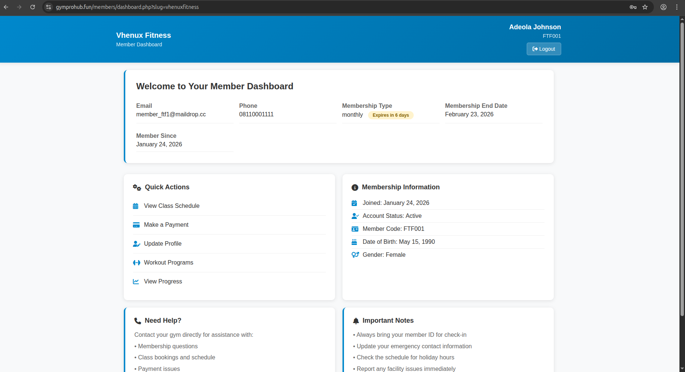

# GymCRM - Enterprise Gym Management SaaS

> **⚠️ IMPORTANT: Portfolio Repository**
> 
> This repository contains the **complete file structure** and **database schema** of a production-ready Gym Management System I architected and built. 
> 
> **File structure preserved** - Shows organization and architecture  
> **Database schema preserved** - Shows data relationships
> **Screenshots included** - Shows actual UI/UX
> **Business logic removed** - All proprietary code replaced with placeholders
> 
> **Interested in the actual implementation?** Contact me for:
> - Live demo access
> - Architecture deep-dive
> - Code review session (NDA required)

---

## Project Overview

**GymCRM** is a multi-tenant SaaS platform serving **50+ gyms** across Nigeria. It provides:

- **White-labeled portals** - Each gym gets their own branded system
- **Offline-first architecture** - Works without internet, syncs when online
- **Multi-payment support** - Paystack, bank transfers, POS, cash
- **Member self-service** - Members register, pay, and book classes online
- **Staff management** - Role-based access (admin, trainer, receptionist)
- **Analytics & reporting** - Revenue, attendance, member retention

**Role**: Lead Developer & System Architect  
**Timeline**: 8 months (active development)  
**Tech Stack**: PHP 8.3, MySQL 8.0, JavaScript, PWA, Paystack API

---

## 📸 Quick Preview

| Admin Dashboard | Member Portal | White Label |
|----------------|---------------|-------------|
|  |  |  |

---

## System Architecture
┌─────────────────────────────────────────────────────────────┐
│ CLIENT LAYER │
├─────────────┬───────────────┬───────────────┬───────────────┤
│ Web App │ PWA App │ Admin Panel │ Member API │
│ (PHP/JS) │ (Service │ (jQuery/ │ (RESTful) │
│ │ Worker) │ Bootstrap) │ │
└─────────────┴───────────────┴───────────────┴───────────────┘
│
┌─────────────────────────────────────────────────────────────┐
│ APPLICATION LAYER │
├─────────────┬───────────────┬───────────────┬───────────────┤
│ Auth & │ Payment │ White-Label │ Offline │
│ Roles │ Processor │ Engine │ Sync │
├─────────────┼───────────────┼───────────────┼───────────────┤
│ Member │ Attendance │ Class/ │ Reporting │
│ Management │ Tracking │ Workout │ Engine │
└─────────────┴───────────────┴───────────────┴───────────────┘
│
┌─────────────────────────────────────────────────────────────┐
│ DATA LAYER │
├─────────────────────────────────────────────────────────────┤
│ MySQL 8.0 Database │
│ 50+ Tables | Multi-tenant | Optimized Views │
└─────────────────────────────────────────────────────────────┘
│
┌─────────────────────────────────────────────────────────────┐
│ INTEGRATION LAYER │
├─────────────┬───────────────┬───────────────┬───────────────┤
│ Paystack │ NaijaBased │ SMTP/PHP │ SMS Gateway │
│ Payments │ Directory │ Mailer │ │
└─────────────┴───────────────┴───────────────┴───────────────┘

text

**[View Full Architecture Documentation](_docs/02-architecture.md)**

---

## Key Features

### Multi-Tenant Architecture
- **50+ Gyms** on single instance with complete data isolation
- **Custom subdomains**: `gymname.gymcrm.com`
- **Custom domains**: Point your own domain
- **Tiered subscription**: Free, Core, Portal, Enterprise

### White-Label Platform
- **Complete branding control** - Colors, logos, favicons
- **Hide GymCRM branding** - Optional whitelabel
- **Custom CSS** - Advanced customization
- **Email templates** - Branded member communications

**[View All Features](_docs/03-features.md)**

---

## Database Schema (Preserved)

The full database schema is available in this repo showing 50+ tables with proper relationships, indexes, and views.

**Key Tables:**
- `gyms` - Multi-tenant root
- `members` - Member profiles & memberships
- `payments` - Transaction history
- `white_label_settings` - Branding configuration
- `attendance` - Check-in/out tracking
- `notifications` - In-app & email notifications

**[View Complete Schema](_docs/04-database-schema.md)**

---

## Technical Challenges Solved

### **1. Offline-First Architecture**
**Problem**: Nigerian gyms face frequent internet outages  
**Solution**: 
- Service Worker caches static assets
- IndexedDB for offline data storage
- Background sync when connection restored
- Queue system for failed operations

### **2. Dynamic White-Labeling**
**Problem**: 50+ gyms need unique branding  
**Solution**:
- Per-gym CSS generation
- Dynamic logo injection
- Custom domain support
- Database-driven theming

### **3. Multi-Gateway Payments**
**Problem**: Members have different payment preferences  
**Solution**:
- Paystack integration (cards, transfer, USSD)
- Manual payment tracking
- Auto-expiring memberships
- Webhook verification

**[View All Challenges & Solutions](_docs/05-challenges.md)**

---

## Real-World Impact

| Metric | Achievement |
|--------|------------|
|  **Active Gyms** | 50+ |
|  **Total Members** | 15,000+ |
|  **Processed Payments** | ₦50M+ |
|  **PWA Installs** | 2,000+ |
|  **Offline Sessions** | 500+ daily |

---

## 🔧 Technical Stack
├── Backend
│ ├── PHP 8.3 - Core application logic
│ ├── MySQL 8.0 - Database with views & triggers
│ └── Apache/Nginx - Web server
│
├── Frontend
│ ├── JavaScript (Vanilla) - No heavy frameworks
│ ├── Bootstrap 5 - Responsive UI
│ ├── PWA - Service Workers, Manifest
│ └── Chart.js - Analytics visualizations
│
├── Integrations
│ ├── Paystack API - Payment processing
│ ├── NaijaBased API - Business directory
│ ├── PHPMailer - Email delivery
│ └── SMS Gateway - Text notifications
│
└── DevOps
├── Git - Version control
├── Composer - Dependency management
└── cPanel/Shared Hosting - Deployment

text

---

##  Project Structure (Preserved)
gym-crm
┣ 📂admin - Complete gym owner/admin panel
┣ 📂api - RESTful API endpoints (v1, white-label)
┣ 📂app - MVC architecture (Controllers, Models)
┣ 📂assets - CSS, JS, Images, Uploads
┣ 📂config - Database, constants, services
┣ 📂database - Migration files
┣ 📂includes - Core helpers, features, middleware
┣ 📂members - Member portal (PWA)
┣ 📂payments - Paystack integration
┣ 📂staff - Staff management interface
┗ 📜*.php - 100+ entry points (logic removed)

text

**[Browse Full Structure](/)**

---

## Screenshot Gallery

| Section | Preview |
|--------|---------|
| **Dashboard** | [View Gallery](_screenshots/01-dashboard/) |
| **Member Management** | [View Gallery](_screenshots/02-member-management/) |
| **Payments** | [View Gallery](_screenshots/03-payments/) |
| **White Label** | [View Gallery](_screenshots/04-white-label/) |
| **Offline Mode** | [View Gallery](_screenshots/05-offline-mode/) |
| **Analytics** | [View Gallery](_screenshots/06-analytics-reports/) |

---

## Getting Started (For Portfolio Review)

This repository is for **portfolio and demonstration purposes only**.

**To review this project:**
1. Browse the file structure to understand organization
2. Review the database schema in the SQL dump
3. View screenshots to see UI/UX
4. Read documentation for architecture decisions

**For live demo or code review:**
- Email: nicklaniyi@gmail.com
- LinkedIn: https://www.linkedin.com/in/nicklaniyi/
- Portfolio: https://www.naijabased.fun/nick-laniyi

---

## License

This repository contains **proprietary code** replaced with placeholders.  
No license granted for use, reproduction, or distribution.

© 2024 [Your Name]. All rights reserved.

---

## Acknowledgments

- **Paystack** - Payment infrastructure
- **NaijaBased** - Business directory partnership
- **All 50+ gym owners** - Early adopters and feedback

---

**If you're impressed by what you see, let's connect!** 